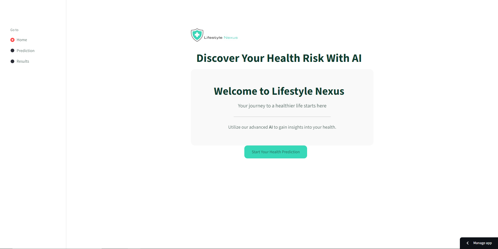
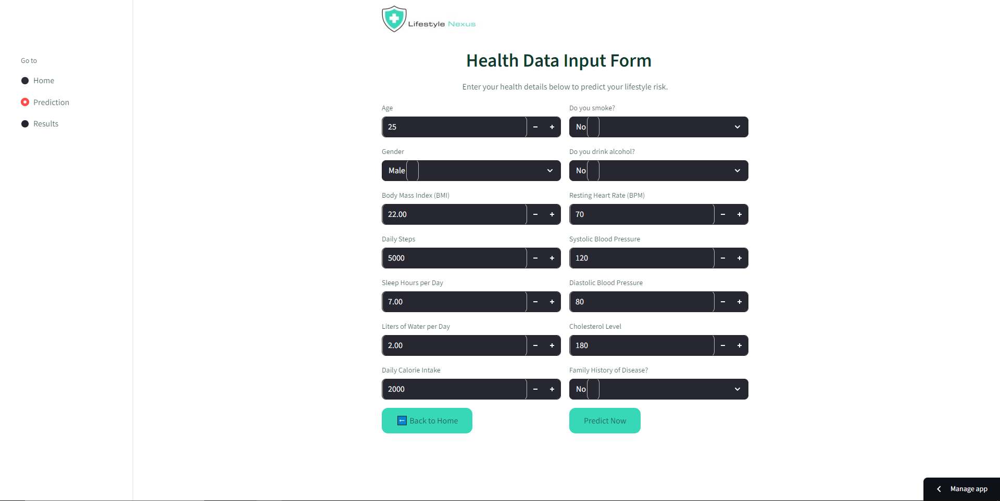
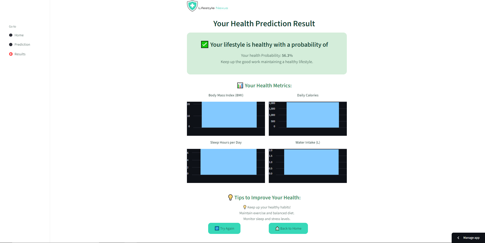

# 🍃 Lifestyle Nexus

**Lifestyle Nexus** is an AI-powered web application that assesses users’ lifestyles from a health perspective.
It analyzes health and lifestyle metrics — such as age, BMI, sleep, and activity — to predict potential health risks using machine learning.
The goal is to empower individuals to make healthier choices by understanding how daily habits impact long-term well-being.

---

## 🌐 Live Demo

🚀 [Try the App on Streamlit](#)
*(https://lifestylenexus-e4nd9guffhcyriy77xxrun.streamlit.app/)*
---

## 🏥 Project Overview

Lifestyle Nexus was created to address the rising concern of lifestyle-related diseases like diabetes and hypertension.
By combining **data science** and **AI**, the app predicts health risks early and provides insights based on a user’s habits.

> “Recognizing your health risks is the first step toward prevention.”

---

## 🧠 Objectives

* Analyze users’ lifestyle data to predict potential health risks.
* Provide a simple, interactive interface for personalized risk prediction.
* Promote awareness of healthy living through AI-driven insights.

---

## 📸 Pages Overview

### 🏠 Main Page

**Discover Your Health Risk With AI**
Welcome to **Lifestyle Nexus** — your journey to a healthier life starts here.
Utilize our advanced AI to gain insights into your health and make informed choices for your well-being.

🖼️ *Example Screenshot (Main Page)*

---

### 📋 Prediction Page

Users are invited to enter their health details such as:

* Age, Gender, and BMI
* Daily Steps and Sleep Hours
* Water Intake and Calorie Consumption
* Smoking and Alcohol Habits
* Resting Heart Rate and Blood Pressure
* Cholesterol Level and Family History

🖼️ *Example Screenshot (Prediction Page)*

---

### ✅ Result Page

After submitting the form, the model processes the data and displays the predicted lifestyle risk.

> Example Result:
> “Based on your current lifestyle, you are at *low risk* for major lifestyle-related diseases.”

🖼️ *Example Screenshot (Result Page)*

---

## ⚙️ Features

* AI-driven health risk prediction
* Interactive Streamlit interface
* High-performance **LightGBM** classification model
* **SMOTE** for balancing imbalanced datasets
* **RandomizedSearchCV** for hyperparameter tuning
* Real-time predictions and intuitive visual feedback

---

## 🧩 Tech Stack

| Category                     | Tools / Libraries        |
| ---------------------------- | ------------------------ |
| **Programming Language**     | Python                   |
| **Framework**                | Streamlit                |
| **Machine Learning**         | Scikit-learn, LightGBM   |
| **Data Processing**          | Pandas, NumPy            |
| **Imbalanced Data Handling** | Imbalanced-learn (SMOTE) |
| **Visualization**            | Matplotlib / Seaborn     |

---

## 🧪 Model Pipeline

### 1. **Data Preprocessing**

* Cleaned missing values
* Encoded categorical variables
* Balanced dataset using SMOTE

### 2. **Model Training**

* Used **LightGBM** for classification
* Applied **Randomized Search** for hyperparameter optimization

### 3. **Evaluation**

* Assessed accuracy, precision, recall, and F1-score
* Visualized model performance using confusion matrix and ROC curve

### 4. **Deployment**

* Built and deployed a **Streamlit web app** for easy interaction and prediction display

---

## 📊 Example Dataset Features

| Feature           | Description                  |
| ----------------- | ---------------------------- |
| Age               | User’s age                   |
| Gender            | Male / Female                |
| BMI               | Body Mass Index              |
| Daily Steps       | Average steps per day        |
| Sleep Hours       | Average sleep duration       |
| Water Intake      | Liters per day               |
| Calories          | Daily calorie intake         |
| Smoking / Alcohol | Yes / No                     |
| Heart Rate        | Resting BPM                  |
| Blood Pressure    | Systolic / Diastolic         |
| Cholesterol       | mg/dL                        |
| Family History    | Hereditary disease indicator |

---

## 👩🏻‍💻 Team Members

* **Weam Abbas**
  📫 [LinkedIn](https://www.linkedin.com/in/weam-abbas-855a63285/)

* **Maryam Alharthi**
  📫 [LinkedIn](https://www.linkedin.com/in/maryam-alharthi-1b252b378/)

* **Moath Hamdan**
  📫 [LinkedIn](http://linkedin.com/in/moath-hamdan/)

* **Adel Al-Lahibi**
  📫 Email "adelbq16@gmail.com"

---

## 🖼️ Presentation Reference

This project was introduced in the
📘 **Blue Illustrated Medical Center Presentation**,
highlighting the motivation, dataset, model design, and demo flow.

---

## 🙌 Acknowledgments

Special thanks to mentors, instructors, and contributors who guided the development of this project.

---

⭐ **If you liked this project, don’t forget to star the repo!**

> “A healthy lifestyle begins with awareness — and awareness begins with data.”

